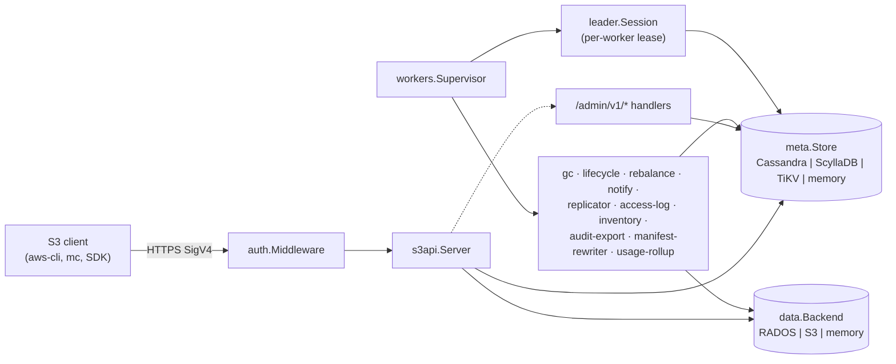

# Architecture

Strata is an S3-compatible gateway built on three swappable tiers: an
HTTP S3 surface, an ordered metadata store, and a chunked data
backend. The responsibilities are deliberately narrow at each layer so
a backend swap (memory → Cassandra → TiKV; memory → RADOS → S3-over-S3)
drops in without touching the router or the workers. A single `strata`
binary plays both gateway and worker roles — the HTTP listener serves
S3 traffic, and `STRATA_WORKERS=` opts the same process into one or
more background loops.

The router (`s3api.Server`) is a flat query-string dispatcher that
mirrors the AWS S3 wire shape: every sub-resource (`?cors`, `?policy`,
`?uploads`, `?uploadId=…`) is keyed by the presence of a query
parameter. Auth runs ahead of any path rewriting so SigV4 signs the
original URL, and the admin carve-out (`/admin/v1/…`) bypasses S3
dispatch entirely. The router never talks to a backend directly — it
funnels through the `meta.Store` and `data.Backend` interfaces.

The metadata layer (`meta.Store`) is intentionally minimal: compare-
and-set on object manifests, range scans with clustering order, blob
config CRUD for per-bucket policies. Three first-class backends
implement it — Cassandra (the original sharded-fan-out shape with
ScyllaDB as a CQL-compatible drop-in) and TiKV (raw KV with native
ordered range scans that short-circuit the fan-out via the optional
`meta.RangeScanStore` interface). The in-memory backend exists for
tests and the smoke pass.

The data backend (`data.Backend`) handles opaque fixed-size chunks
only — the per-object manifest lives in the metadata layer, the data
backend never reads it. RADOS splits every object body into 4 MiB
chunks; S3-over-S3 streams through upstream multipart; the in-memory
backend keeps a `[]byte` per chunk. Multi-cluster routing
(`internal/data/placement/`) is a thin layer that picks one cluster
per PUT from the bucket's placement policy, the per-cluster weight
wheel, and the drain map.

Background workers (gc, lifecycle, notify, replicator, access-log,
inventory, audit-export, manifest-rewriter, rebalance, usage-rollup,
quota-reconcile) run inside the same binary. Each worker is leader-
elected on a per-name lease, panic-recovered with exponential backoff,
and supervised so one worker's failure never touches the gateway or
sibling workers. The fan-out workers (gc, rebalance) split work
across shards with one lease per shard so a single replica can drain
multiple shards in parallel without coordinating with siblings.

## Component map

## Critical flows

{}
- 
  **PUT flow**  
  Object PUT end-to-end — SigV4, manifest compare-and-set, chunk
  write, CAS-loser cleanup. Sequence diagram of the hot path.
  

- 
  **Multi-cluster routing**  
  How a PUT picks a cluster — bucket-policy short-circuit, cluster
  weight wheel, drain exclusion, storage-class spec. Flowchart of
  the picker.
  

- 
  **Drain pipeline**  
  Cluster lifecycle (`live` → `draining_*` → `removed`), rebalance
  worker scan loop, deregister-ready gate. State diagram + safety
  rails.
  
{}

{}
- 
  **Worker + leader election**  
  Supervisor → `leader.Session` → heartbeat chip → shard fan-out.
  How a worker lifts off and how panics are isolated.
  
{}

## Per-layer pages

{}
- 
  **Auth**  
  SigV4, presigned URLs, streaming chunk decoder, virtual-hosted-
  style routing, identity attribution.
  

- 
  **Router**  
  `s3api.Server` query-string dispatch shape, vhost rewriting,
  admin path carve-out.
  

- 
  **Meta store**  
  The `meta.Store` contract, LWT semantics, range scans, the
  optional `RangeScanStore` short-circuit.
  
{}

{}
- 
  **Data backend**  
  RADOS 4 MiB chunking, manifest format (proto vs JSON sniff,
  schema-additive evolution), multi-cluster routing, S3-over-S3.
  

- 
  **Workers**  
  Supervisor model, registration via `init()`, leader-election
  shape, panic restart with backoff, per-worker reference.
  

- 
  **Sharding**  
  `(bucket_id, shard)` partitioning, fan-out merge, gc fan-out,
  online reshard.
  
{}

{}
- 
  **Observability**  
  slog, audit log, request_id propagation, OTel tracing
  (tail-sampler + ring buffer), per-storage observers.
  

- 
  **Storage**  
  Meta + data backend health surfacing in the operator console.
  
{}

## Per-backend deep dives

{}
- 
  **Backends**  
  TiKV, ScyllaDB, S3-over-S3 — capabilities, gotchas, when to pick
  which.
  

- 
  **Benchmarks**  
  GC + lifecycle scaling, meta-backend comparison, RADOS ops,
  parallel-chunk read.
  

- 
  **Migrations**  
  Binary consolidation, GC + lifecycle Phase 2, TiKV-default lab,
  drain-progress physicalisation.
  
{}
