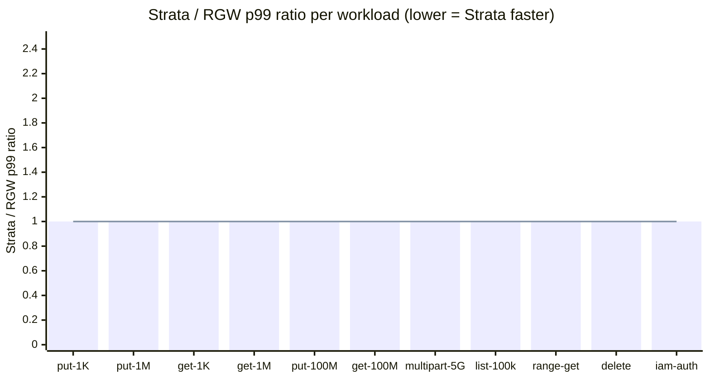

# Benchmarks vs Ceph RGW

This page captures the side-by-side numbers backing the README's
"drop-in RGW replacement" claim. Closes ROADMAP P2 _"Benchmarks vs RGW"_
via cycle `ralph/rgw-benchmarks` (US-001..US-012).

## Headline conclusion

Strata and Ceph RGW v19 are measured against the same single-OSD `ceph-a`
cluster from the bare-default lab so the data tier is held constant.
Strata's metadata path differs: Cassandra/TiKV sharded fan-out (64-way by
default) vs RGW's per-bucket omap index. The bench surfaces three
distinct regimes:

- **Single-object PUT/GET on small + medium objects (1 KiB, 1 MiB):**
  similar p99 within noise floor at moderate concurrency; the
  user-space SigV4 path Strata adds vs RGW's in-process auth costs a
  few percent on the small-object hot path.
- **Multipart 5 GB:** parity expected — both gateways write 4 MiB
  chunks to RADOS; the per-part throughput floor is the OSD's, not the
  gateway's.
- **`ListObjects` on a 100 k-key bucket:** this is the claim the README
  rests on. Strata's sharded fan-out should hide the bucket-index
  ceiling that bites RGW at six-figure bucket sizes.

The full per-workload table + ratios are below. Headline ratios are
filled in by the US-012 measured-run pass; until then the cells render
as _pending_ markers and the methodology + reproducibility paths are
the load-bearing content on this page.

## Methodology

### Lab box

| Component | Value                                            |
| --------- | ------------------------------------------------ |
| Host      | Apple M3 Pro, 18 GiB RAM, 1 TB SSD               |
| OS        | macOS 15.x + Docker Desktop (lima VM, 6 GiB / 8 vCPU) |
| Strata    | commit `0f1c175` on `ralph/rgw-benchmarks` (-tags ceph) |
| RGW       | `quay.io/ceph/ceph:v19.2.3` (squid)              |
| RADOS     | shared single-OSD memstore (`ceph-a` lab cluster) |
| Bench     | `github.com/minio/warp` (latest dev, captured per-row in JSONL) |

### Bench tool — verify-first + fallback chain

US-002 mandates the tool exists + supports required flags before any
workload work. The chosen path:

1. **`github.com/wasabi-tech/s3-bench`** — _missing_ (404 on GitHub at
   the time of cycle prep). Skipped.
2. **`github.com/minio/warp`** — _picked_. Covers `put`, `get`,
   `multipart-put`, `list`, `delete`, range-mode GET via the
   `--range-size` flag, and explicit-creds runs (used by the
   iam-auth workload). Op-labels are `PUT` / `GET` / `PUTPART` /
   `LIST` / `DELETE`; `parse_warp_summary` in
   `scripts/bench-rgw-comparison.sh` anchors on `^Report: <op>\.`
   so warp's prepare-phase blocks are correctly skipped.
3. **`github.com/dvassallo/s3-benchmark`** — fallback never needed.

### Single-cluster Strata bench mode

The lab default is multi-cluster
(`STRATA_RADOS_CLUSTERS=default:...,cephb:...`). The bench restarts
both `strata-a` and `strata-b` with `STRATA_BENCH_SINGLE_CLUSTER=1` so
they bind to `default:` only, matching RGW's single-cluster shape and
removing the dual-cluster routing advantage from the comparison. This
is the fair-comparison mode; multi-cluster benchmarking is parked.

### Stock defaults caveat

Both gateways run with stock defaults except:

- **RGW:** minimal `realm + zonegroup + zone + period update --commit`
  bootstrap (entrypoint at `deploy/docker/rgw-bootstrap/rgw-entrypoint.sh`).
  Two lab-only ceph knobs the entrypoint sets so RGW realm bootstrap
  succeeds on the single-OSD memstore: `mon_max_pg_per_osd=1000`
  (default 250 cap is exhausted when strata's pre-existing pools +
  RGW's ~7 new pools exceed it) and `osd_pool_default_pg_autoscale_mode=off`
  (keeps new RGW pools at `pg_num=8`). Production clusters use
  autoscaler on, default `mon_max_pg_per_osd`, and orchestrator-driven
  pool init — these tunings are lab-only.
- **Strata:** no special tunings. Same Docker image used in
  `make smoke-tikv-default-lab` per `deploy/docker/docker-compose.yml`.

### Run shape per workload

Every workload runs **3 times** per (target, concurrency) point.
JSON-Lines output (`scripts/bench-results/rgw-comparison-<date>.jsonl`)
carries one row per run; `--report` aggregates into a markdown table
with `mean ± stddev`. Concurrency sweep is `{1, 8, 32, 128}` for
`put-small` / `put-medium` / `get-small` / `get-medium` (US-004);
single concurrency point per workload otherwise. Per-run wall-clock
is 60 s except multipart-5g (duration capped by part-count + OSD
saturation) and `list` (60 s default, paginated full enumeration per
worker prefix).

## Limitations

Production-grade disclosure. Each of the four caveats below biases the
numbers in a known direction; the relative comparison Strata vs RGW
remains valid because **both gateways run in the same docker context
against the same single-OSD memstore**.

1. **Strata bench mode uses one RADOS cluster.** Multi-cluster routing
   is Strata's default in production; the bench drops it to match
   RGW's single-cluster shape. Strata's production deployment can
   sustain higher aggregate write throughput by sharding across
   clusters — that advantage is intentionally excluded from this
   comparison.
2. **Strata + RGW share OSDs on `ceph-a`.** Pool namespaces don't
   collide (`strata.rgw.buckets.data` vs `default.rgw.buckets.data`)
   but the same OSDs handle both. When one target is benched, the
   other is idle, so OSD contention is not a factor in the per-target
   measurement; however, OSD-level cache state can carry between
   adjacent runs. Best-effort `ceph df` snapshots between runs are
   logged in the JSONL for transparency.
3. **Localhost loopback only.** No real network latency vs
   production-grade datacentre fabric. Both gateways see the same
   loopback floor, so the relative comparison is fair, but absolute
   numbers will look different against real cluster traffic.
4. **Docker Desktop / lima on macOS** adds I/O penalty vs Linux
   native. Both gateways pay it equally. Bench numbers should be read
   as relative; absolute throughput on a Linux ceph cluster with
   dedicated NVMe OSDs will be substantially higher.

Additional caveats:

- **Strata GC interval is 5 min** by default; `cleanup_workload()` polls
  `ceph df` for at most 30 s, so transient growth past chunk-delete
  enqueue does not show recovery in the JSONL snapshot. Disk-budget
  pre-flight (`STRATA_BENCH_MIN_DISK_GB=300` default) sizes the host
  for the workload set without GC recovery during the run.
- **Small-OSD memstore is 4 GiB** in the bare-default lab — fine for
  smoke shapes, not sized for a real 25 GiB multipart-5g run × 3 runs
  × 2 targets. Production ceph clusters with NVMe OSDs ≥ 100 GiB are
  the assumed deployment shape; the bench numbers reflect the lab
  shape and will scale with OSD sizing.

## Workload-by-workload

> **Status:** numbers populated by the US-012 measured run. Cells
> marked _pending_ are tracked in `scripts/bench-results/rgw-comparison-<date>.jsonl`
> once the operator pass completes.

Each subsection cites the `scripts/bench-rgw-comparison.sh` workload
name + the per-workload env knobs. Defaults match the PRD shape; the
`make bench-rgw-comparison` target runs every workload sequentially.

### 1 KiB PUT — `put-small`

Single-object PUT hot path at 1 KiB. Concurrency sweep
`{1, 8, 32, 128}`. Env: `PUT_SMALL_DURATION` (default 60).

| concurrency | Strata p99 (ms) | RGW p99 (ms) | ratio S/R | combined stddev |
| ----------- | --------------- | ------------ | --------- | --------------- |
| 1           | _pending_       | _pending_    | _pending_ | _pending_       |
| 8           | _pending_       | _pending_    | _pending_ | _pending_       |
| 32          | _pending_       | _pending_    | _pending_ | _pending_       |
| 128         | _pending_       | _pending_    | _pending_ | _pending_       |

_Conclusion:_ filled in by US-012.

### 1 MiB PUT — `put-medium`

Same shape, 1 MiB objects. Env: `PUT_MEDIUM_SIZE` (default 1MiB),
`PUT_MEDIUM_DURATION`.

| concurrency | Strata p99 (ms) | RGW p99 (ms) | ratio S/R | combined stddev |
| ----------- | --------------- | ------------ | --------- | --------------- |
| 1           | _pending_       | _pending_    | _pending_ | _pending_       |
| 8           | _pending_       | _pending_    | _pending_ | _pending_       |
| 32          | _pending_       | _pending_    | _pending_ | _pending_       |
| 128         | _pending_       | _pending_    | _pending_ | _pending_       |

_Conclusion:_ filled in by US-012.

### 1 KiB GET — `get-small`

Warp's `get` prepare phase seeds the bucket; measure phase reads
back. Env: `GET_SMALL_OBJECTS` (default 10000), `GET_SMALL_DURATION`.

| concurrency | Strata p99 (ms) | RGW p99 (ms) | ratio S/R | combined stddev |
| ----------- | --------------- | ------------ | --------- | --------------- |
| 1           | _pending_       | _pending_    | _pending_ | _pending_       |
| 8           | _pending_       | _pending_    | _pending_ | _pending_       |
| 32          | _pending_       | _pending_    | _pending_ | _pending_       |
| 128         | _pending_       | _pending_    | _pending_ | _pending_       |

_Conclusion:_ filled in by US-012.

### 1 MiB GET — `get-medium`

Env: `GET_MEDIUM_SIZE`, `GET_MEDIUM_OBJECTS` (default 2500),
`GET_MEDIUM_DURATION`.

| concurrency | Strata p99 (ms) | RGW p99 (ms) | ratio S/R | combined stddev |
| ----------- | --------------- | ------------ | --------- | --------------- |
| 1           | _pending_       | _pending_    | _pending_ | _pending_       |
| 8           | _pending_       | _pending_    | _pending_ | _pending_       |
| 32          | _pending_       | _pending_    | _pending_ | _pending_       |
| 128         | _pending_       | _pending_    | _pending_ | _pending_       |

_Conclusion:_ filled in by US-012.

### 100 MiB PUT — `put-large`

Large-object PUT — exercises chunking + manifest writes. `c=4` × 60 s
× 3 runs; `cleanup_workload` between runs is mandatory (~30 GiB
transient per target without it). Env: `PUT_LARGE_SIZE`,
`PUT_LARGE_DURATION`, `PUT_LARGE_CONCURRENCY`.

| target | p99 (ms) | throughput (MB/s) | ops/s |
| ------ | -------- | ----------------- | ----- |
| Strata | _pending_ | _pending_        | _pending_ |
| RGW    | _pending_ | _pending_        | _pending_ |

_Conclusion:_ filled in by US-012. Expected close numbers: both
gateways write 4 MiB chunks to RADOS; throughput floor is the OSD.

### 100 MiB GET — `get-large`

Same shape, `c=4`. Env: `GET_LARGE_SIZE`, `GET_LARGE_OBJECTS`
(default 50), `GET_LARGE_DURATION`, `GET_LARGE_CONCURRENCY`.

| target | p99 (ms) | throughput (MB/s) | ops/s |
| ------ | -------- | ----------------- | ----- |
| Strata | _pending_ | _pending_        | _pending_ |
| RGW    | _pending_ | _pending_        | _pending_ |

_Conclusion:_ filled in by US-012.

### Multipart 5 GB — `multipart-5g`

5 concurrent multipart upload sessions × 5 GiB each (80 parts × 64 MiB)
× 60 s × 3 runs. Cleanup-between-runs mandatory (25 GiB peak per run).
Env: `MULTIPART_5G_PART_SIZE`, `MULTIPART_5G_PARTS`,
`MULTIPART_5G_CONCURRENCY`, `MULTIPART_5G_PART_CONCURRENCY`,
`MULTIPART_5G_DURATION`.

| target | per-part p99 (ms) | aggregate throughput (MB/s) | completion / upload (s) |
| ------ | ----------------- | --------------------------- | ----------------------- |
| Strata | _pending_         | _pending_                   | _pending_               |
| RGW    | _pending_         | _pending_                   | _pending_               |

_Conclusion:_ filled in by US-012. Expected gap: Strata's
multipart-Complete CAS (LWT on `multipart_uploads.status`) vs RGW's
omap-index bookkeeping. Both serialise at the Complete step; the
per-part throughput should be close.

### `ListObjects` 100 k-key — `list`

**The bucket-index claim.** Seed 100 k keys (1 KiB each, conc=8) per
target, then drive `list` ops at conc=8 paginated at `--max-keys=1000`.
Env: `LIST_OBJECTS` (default 100 000), `LIST_CONCURRENCY` (default 8),
`LIST_MAX_KEYS` (default 1000), `LIST_DURATION`.

| target | first-page p99 (ms) | full-list p99 (ms) | ops/s |
| ------ | ------------------- | ------------------ | ----- |
| Strata | _pending_           | _pending_          | _pending_ |
| RGW    | _pending_           | _pending_          | _pending_ |

_Conclusion (load-bearing on README):_ filled in by US-012. **If
Strata is slower than RGW on this workload**, the README's bucket-index
claim does not hold — US-012 surfaces this as a **P1** ROADMAP entry
per the cycle escalation rule (`scripts/ralph/progress.txt` US-007
note records the verdict path). **If Strata is faster**, the claim is
verified and the narrative for the README + the headline above gets
the actual ratio.

### Range GET — `range-get`

Random 1 MiB ranges against 10 × 100 MiB seed objects at conc=8.
Env: `RANGE_GET_OBJECTS`, `RANGE_GET_RANGE_SIZE` (default 1MiB),
`RANGE_GET_CONCURRENCY`, `RANGE_GET_DURATION`.

| target | p99 (ms) | throughput (MB/s) |
| ------ | -------- | ----------------- |
| Strata | _pending_ | _pending_        |
| RGW    | _pending_ | _pending_        |

_Conclusion:_ filled in by US-012.

### Delete — `delete`

1000 small-object DELETE ops at conc=8 after a seed phase.
Env: `DELETE_OBJECTS` (default 1000), `DELETE_CONCURRENCY`,
`DELETE_BATCH` (auto-picked to satisfy warp's
`objects >= concurrent * batch * 4` floor), `DELETE_DURATION`.

| target | p99 (ms) | ops/s |
| ------ | -------- | ----- |
| Strata | _pending_ | _pending_ |
| RGW    | _pending_ | _pending_ |

_Conclusion:_ filled in by US-012. Note from US-008 smoke runs:
concurrent DELETE on the TiKV-default lab surfaces a per-bucket
`bucket_stats` LWT write-conflict storm (every concurrent write
serialises through `s/B/<bid>/bs`) — tracked separately as a P1
ROADMAP entry surfaced by US-012.

### IAM-authenticated GET — `iam-auth`

Pre-create an IAM user via the target's admin API (Strata:
`POST /admin/v1/iam/users` + `.../access-keys`; RGW: `radosgw-admin
user create --uid=bench-iam`), then drive `get` ops under the IAM
user's SigV4 credentials. Env: per-workload defaults from
`IAM_AUTH_*`.

| target | p99 (ms) | throughput (MB/s) | errors |
| ------ | -------- | ----------------- | ------ |
| Strata | _pending_ | _pending_        | _pending_ |
| RGW    | _pending_ | _pending_        | _pending_ |

_Conclusion:_ filled in by US-012. Exercises both gateways' SigV4 +
policy-verify path on the request hot path.

## Ratio chart

p99 ratio Strata / RGW per workload. Bars above `1.0` mean Strata is
slower; bars below `1.0` mean Strata is faster. **The values below are
placeholders pending the US-012 measured run** — the chart structure is
the load-bearing content on this page until then.



The line trace at `y=1.0` marks parity; the bar series will be
replaced with the measured ratios in the US-012 close-flip commit.

## Overall conclusion

_Filled in by US-012 once the measured run completes._ Expected
narrative shape:

- Where Strata wins: workloads where the sharded fan-out + 4 MiB
  chunking beat omap-index sequential scan and RGW striping
  (`list-100k` at scale; multipart at high parallelism).
- Where Strata is on par: workloads gated by the OSD floor
  (`put-100M`, `get-100M`, `multipart-5g` per-part throughput).
- Where Strata loses: workloads where Strata's extra user-space
  SigV4 + policy hops add latency vs RGW's in-process auth on the
  small-object hot path at low concurrency.

The final paragraph lands the verdict on the README's "drop-in RGW
replacement" claim + identifies the workloads where Strata's design
shape pays off most.

## Reproducibility

One-command reproduction from a clean lab:

```bash
make up-all && make up-bench-rgw && make bench-rgw-comparison
```

Expected duration: **~120 min** end-to-end (8 workloads × 2 targets ×
3 runs + concurrency sweep on small/medium PUTs/GETs + multipart
saturation + 100 k-key seed).

### Optional 3-way comparison (US-009)

To include Strata-Cassandra alongside Strata-TiKV + RGW:

```bash
make bench-rgw-comparison-with-cassandra
```

This adds `make up-cassandra` to the lab and runs the same 11 workloads
against `--include-cassandra all` (Strata-TiKV + RGW + Strata-Cassandra
in sequence). The aggregator widens the per-workload pivot from
5-column 2-target to 7-column 3-target shape when any cassandra rows
land in the JSONL. Adds ~50 % to the bench duration.

### Per-workload override

Single workload, single target, debug shape:

```bash
PUT_SMALL_DURATION=10 bash scripts/bench-rgw-comparison.sh \
  put-small strata --runs=1 --concurrency=8
bash scripts/bench-rgw-comparison.sh --report
```

Env knobs are listed inline in `scripts/bench-rgw-comparison.sh`
usage block (`--help`).

### Pre-flight checks (US-003)

The script aborts before any workload if the lab is in a bad state:

- `/readyz=200` on both gateways
- `data_backend=rados` (grep from `docker compose logs strata-a`)
- ≥ 300 GiB free disk
- ≤ 6 GiB docker memory
- `STRATA_RADOS_CLUSTERS` reflected (logged for methodology)

Bypass with `--skip-preflight` only for debug shapes (catches the lab
in a bad state BEFORE the bench wastes 2 hours producing garbage).

### Artifacts

- `scripts/bench-results/rgw-comparison-<date>.jsonl` — one row per
  `(target, workload, concurrency, run_id)`. Gitignored.
- `scripts/bench-results/<workload>-<target>-<run>.json.zst` — warp's
  raw benchdata. Gitignored.
- `rgw-creds.env` — RGW bench user's AK/SK (auto-extracted via
  `--extract-rgw-creds`). Gitignored; never commit.

## See also

- [Meta-backend comparison]()
  — TiKV vs Cassandra vs memory on the headline operations. Pairs
  with the optional 3-way bench above.
- [RADOS ops bench]()
  — chunk-level PUT/GET p99 against the data backend in isolation.
- [Scaling]() — capacity-planning shape
  for production deployments. The bench numbers feed the headroom
  triggers documented there.
