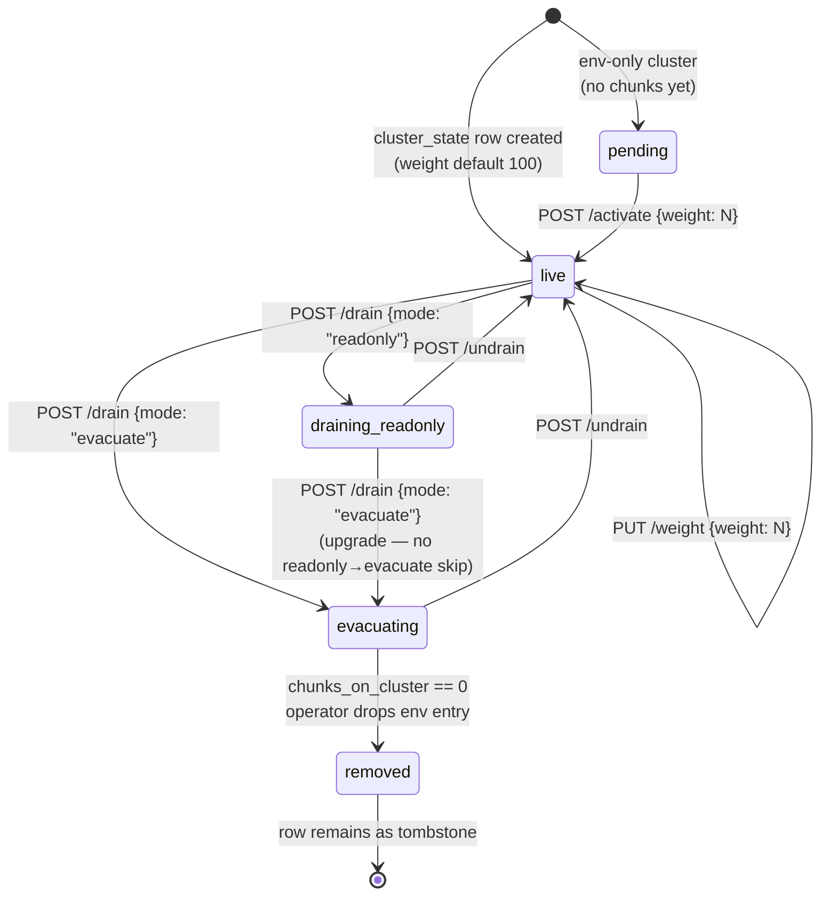

# Drain pipeline

A draining cluster is one that the operator has flagged stop-write so
it can be taken out of rotation safely. Strata models the lifecycle as
a state machine on the `cluster_state` row; the rebalance worker
migrates chunks off in the `evacuating` state; the deregister-ready
gate keeps the operator honest before they drop the cluster from
`STRATA_RADOS_CLUSTERS`.

## State diagram

## States

| State | Picker | Reads | Scan-on-tick | Operator entry |
|---|---|---|---|---|
| `pending` | excluded from default wheel; explicit policy still routes | works | no | `POST /admin/v1/clusters/{id}/activate {weight: N}` flips to `live` |
| `live` (weight > 0) | included proportional to weight | works | no | `PUT /admin/v1/clusters/{id}/weight` adjusts in place |
| `live` (weight == 0) | excluded from default wheel; explicit policy still routes | works | no | legal "drained but not draining" state — useful for staged decommission |
| `draining_readonly` | excluded | works | **no** — readonly is stop-write only | `POST /admin/v1/clusters/{id}/drain {mode: "readonly"}` |
| `evacuating` | excluded | works | **yes** — rebalance worker migrates chunks off | `POST /admin/v1/clusters/{id}/drain {mode: "evacuate"}` or upgrade from readonly |
| `removed` | excluded everywhere | n/a | n/a | operator-flow tombstone — set after deregister |

Stop-write semantics: a draining cluster accepts reads, deletes, HEAD,
multipart `UploadPart` / `Complete` / `Abort`, and listings. Only fresh
PUTs are refused with 503 `DrainRefused` + `Retry-After: 300`.

## Rebalance worker

The `rebalance` worker (one instance per replica, leader-elected on
per-shard `rebalance-leader-<i>` leases — `STRATA_REBALANCE_SHARDS`
controls the count) is the scan loop that migrates chunks off
`evacuating` clusters. Each tick:

1. List buckets owned by this shard (`fnv32a(bucketID) %
   STRATA_REBALANCE_SHARDS == shardID`).
2. Read every manifest. For each chunk whose current cluster does not
   match `placement.PickClusterExcluding` (the picker that excludes
   draining clusters), enqueue a move.
3. Dispatch the move through a backend-specific mover (RADOS
   `Read` + `Write` to the target + per-object manifest CAS; S3
   `CopyObject` or streaming `Get` + `Put` for the S3 backend).
4. On CAS apply: enqueue the old chunk for GC. On CAS reject (a
   concurrent client write landed first): enqueue the **new** chunk
   for GC and skip.
5. Categorise stuck-not-migratable chunks into a per-cluster
   `rebalance.ProgressTracker` snapshot so the admin
   `/drain-progress` endpoint and the operator console can render
   ETA + bandwidth chips without scanning synchronously.

The scan only runs when `cluster_state == "evacuating"`. A `readonly`
drain is stop-write but skips the per-tick scan to save IO.

## Bandwidth + concurrency knobs

| Knob | Default | Range | Notes |
|---|---|---|---|
| `STRATA_REBALANCE_INTERVAL` | `5m` | `1m..24h` | Wall-clock period between scans. |
| `STRATA_REBALANCE_RATE_MB_S` | `100` | `1..10000` | Token bucket shared between read and write — a chunk move costs `chunkSize × 2` tokens. |
| `STRATA_REBALANCE_INFLIGHT` | `4` | `1..64` | Per-Move(plan) errgroup bound. |
| `STRATA_REBALANCE_SHARDS` | `1` | `1..1024` | Per-shard lease count. SHARDS=1 reproduces the pre-fan-out shape byte-for-byte. |

Operator workflow + ETA chips are documented in
[Drain a cluster](); this page
covers the pipeline shape, not the runbook.

## Safety rails

- **Refuse moves into draining targets.** The mover consults the same
  drain map as the picker before copying; targets that flipped to
  drain mid-tick get refused with `strata_rebalance_refused_total{
  reason="target_draining"}`.
- **Refuse moves into full RADOS targets.** `data.ClusterStatsProbe`
  runs `MonCommand df` against every RADOS cluster; above 90 %
  utilisation, moves are refused with
  `strata_rebalance_refused_total{reason="target_full"}`.
- **Per-shard panic isolation.** A panic in shard `i` increments
  `strata_worker_panic_total{worker="rebalance",shard="<i>"}` and
  restarts on `1s → 5s → 30s → 2m` backoff; other shards keep
  scanning.

## Completion + deregister-ready

When the per-cluster chunks count transitions from `>0 → 0`, the
rebalance worker fires a one-shot `drain complete` event:

1. INFO log line `drain complete`.
2. Audit row `drain.complete` (`system:rebalance-worker`,
   `cluster:<id>`).
3. Counter bump `strata_drain_complete_total{cluster}`.
4. Best-effort notify payload `{cluster, bytes_moved, completed_at}`
   through `notify.Sink.Send` for every `STRATA_NOTIFY_TARGETS`
   target.

The admin endpoint `GET /admin/v1/clusters/{id}` returns
`deregister_ready: true` once the chunk count is zero **and** no
in-flight multipart sessions are bound to the cluster (probed via
`meta.Store.ListMultipartUploadsByCluster`). The operator then
removes the cluster from `STRATA_RADOS_CLUSTERS`, redeploys, and
flips the state to `removed`.

## Pre-drain impact preview

`GET /admin/v1/clusters/{id}/bucket-references` lists every bucket
whose `Placement` policy names this cluster, joined with bucket
usage stats (chunk count + bytes). The operator console renders the
list as a "buckets that will refuse PUTs once drain starts" warning
before flipping the drain. Strict-mode buckets stand out — the picker
will refuse PUTs from those buckets once their entire policy is
draining; the console offers a "Flip to weighted" shortcut so the
cluster-weight fallback absorbs the drain.

## Related

- [Multi-cluster routing]()
  — where the picker consults the drain map.
- [Workers]() — rebalance worker
  shape, leader election, supervisor.
- [Worker + leader election]()
  — per-shard lease shape for rebalance + gc fan-out.
- [Drain a cluster]() — the
  operator runbook.
