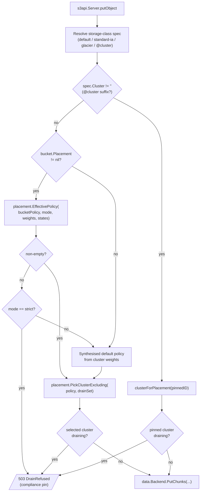

# Multi-cluster routing

Strata can front multiple data clusters (multiple RADOS pools, multiple
upstream S3 endpoints, or a mix). Every PUT picks exactly one cluster
before any chunks land. The picker is a thin layer over three inputs:
the bucket's placement policy, the per-cluster weights from the
`cluster_state` table, and the storage-class spec inferred from the
request headers.

## Flowchart

## The picker contract

`placement.PickCluster` (and its drain-aware sibling
`PickClusterExcluding`) lives in `internal/data/placement/`. The inputs
are deterministic:

- **A policy** — a `map[clusterID]weight` slice. The policy comes from
  one of three places:
  1. The bucket's `Placement` map, if set. Operator opt-in via
     `PUT /admin/v1/buckets/{name}/placement`. Wins over everything
     else.
  2. A storage-class spec with `@cluster` suffix
     (`STRATA_STORAGE_CLASSES=glacier@s3-archive,...`). Pins per
     class without overriding the per-bucket policy.
  3. The synthesised default policy from the cluster-weight wheel —
     `{cluster: weight}` for every cluster whose `cluster_state` row
     is `live` with `weight > 0`. Absence in `cluster_state` is
     treated as `live` for backwards compatibility.
- **An exclude set** — clusters in `draining_readonly` or `evacuating`
  state. Sourced from `placement.DrainCache.States(ctx)` with a 30 s
  TTL that the admin `/drain` and `/undrain` handlers invalidate
  synchronously.

The picker returns a cluster id, the empty string (no eligible
cluster), or an error. The caller maps empty / all-excluded to a 503
`DrainRefused` so the client sees a clean retry signal.

## Bucket policy wins

The single most-load-bearing invariant: **when the bucket has a
non-nil `Placement`, the per-cluster weight from `cluster_state` is
ignored.** Operators set per-bucket placement to satisfy data-locality
or sovereignty constraints; auto-rebalancing buckets away from those
constraints would defeat the point. The picker call sites
(`rados.Backend.PutChunks`, `s3.Backend.clusterForPlacement`) check
bucket-policy presence **before** consulting the weight wheel.

## Effective policy + strict mode

`placement.EffectivePolicy(policy, mode, weights, states)` returns the
policy that actually drives the picker:

1. If every cluster in the policy is live with positive weight →
   return the policy as-is.
2. If some clusters in the policy are draining, filter them out and
   return what remains.
3. If **every** cluster in the policy is draining:
   - `mode == "weighted"` (default) → fall back to the cluster-weight
     wheel. The bucket loses its policy this PUT but the data lands.
   - `mode == "strict"` → return an empty policy → the picker refuses
     → 503 `DrainRefused`. The bucket is pinned and waits for the
     operator to either edit the policy or undrain.

Per-bucket mode is `meta.Bucket.PlacementMode ∈ {"weighted", "strict"}`
and is set via `PUT /admin/v1/buckets/{name}/placement` body. Legacy
rows (`""`) coerce to `"weighted"`.

## Drain exclusion

A cluster in `draining_readonly` or `evacuating` is **stop-write but
not stop-read**. The picker excludes it on PUTs but reads, deletes,
HEAD, multipart `UploadPart` / `Complete` / `Abort`, and listings
against it keep working.

The PUT-hot-path consults `placement.DrainCache.States(ctx)` — an
in-process 30 s-TTL snapshot of every cluster's state. The admin
`/drain` and `/undrain` handlers invalidate the cache synchronously so
flips take effect without waiting out the TTL.

In-flight multipart sessions persist the **initial** cluster id in the
`BackendUploadID` handle (`cluster\x00bucket\x00key\x00uploadID`).
Subsequent `UploadPart` / `Complete` / `Abort` calls recover the
cluster directly from the handle and bypass the picker — so a drain
that flips between `InitMultipart` and `CompleteMultipart` does not
strand the upload. See [PUT flow]().

## Pending clusters

A cluster id that appears in `STRATA_RADOS_CLUSTERS` (env) but has no
chunks yet enters `cluster_state = "pending"` on boot via the
`serverapp.ClusterReconcile` step. Pending clusters are **excluded
from the default weight wheel** so a freshly-added cluster does not
take traffic before the operator activates it. Explicit per-bucket
placement that names the pending cluster still routes there — useful
for shadow-testing before flipping it live.

Operator flips it live via `POST /admin/v1/clusters/{id}/activate
{weight: N}`. Weight adjustment after activation is
`PUT /admin/v1/clusters/{id}/weight {weight: N}`.

## Related

- [PUT flow]() — where the picker
  sits on the PUT path.
- [Drain pipeline]() — what
  happens after a cluster is drained.
- [Data backend]() — the
  cluster-aware `data.Backend` interfaces.
- [Placement + rebalance]()
  — the operator-runbook view.
