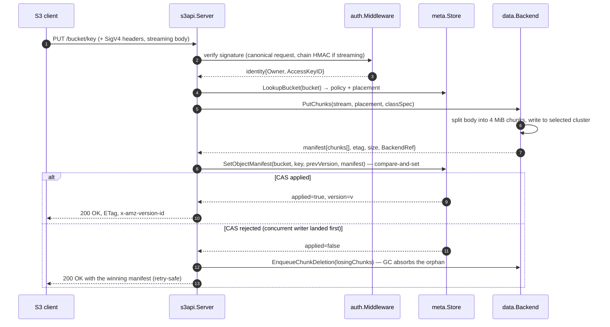

# PUT flow

A single S3 `PutObject` traverses the gateway, the metadata store, and the
data backend. The picture below names the components on the hot path so
the prose that follows can stay focused on the interesting choices —
streaming chunk decode, the manifest compare-and-set, and the failure
modes when one tier wins a race against another.

## Sequence diagram

## Step-by-step

1. **SigV4 verify.** `auth.Middleware` canonicalises the request, computes
   the expected signature against the secret in `auth.StaticStore`, and
   rejects on mismatch. Streaming chunk uploads (`aws-chunked`) carry a
   chain HMAC validated incrementally by `auth.streamingReader` so a
   torn body fails before the manifest is touched. See
   [Auth]().

2. **Bucket lookup.** `s3api.Server.putObject` fetches the bucket row
   from `meta.Store` once and reuses it for ACL, encryption,
   placement-policy, and storage-class checks. A nil-policy bucket
   falls through to the synthesised default policy from the cluster
   weight wheel (see [Multi-cluster routing]()).

3. **Chunk write.** `data.Backend.PutChunks` streams the body through a
   chunker — 4 MiB chunks for RADOS, host-defined upload-part size for
   S3-over-S3. The selected cluster id is captured into each chunk's
   `BackendRef`, so the manifest carries enough information to read the
   object back without re-running the picker.

4. **Manifest compare-and-set.** `meta.Store.SetObjectManifest` runs
   `INSERT … IF NOT EXISTS` (Cassandra) or a pessimistic txn (TiKV) so
   two clients racing to PUT the same key do not silently overwrite
   each other. The loser learns `applied=false` and reads back the
   winner's manifest. Versioned buckets append a `version_id` row
   instead of CAS-ing in place; the latest-version pointer still
   updates via compare-and-set.

5. **Loser cleanup.** When the manifest CAS rejects, the chunks the
   loser already wrote are orphans — referenced by no manifest. The
   gateway enqueues them via `meta.Store.EnqueueChunkDeletion`; the
   `gc` worker drains the queue asynchronously. The client receives
   the winner's response and re-tries cleanly.

## Failure modes

| Stage | Outcome | Side effect |
|---|---|---|
| SigV4 verify fails | 403 `SignatureDoesNotMatch` | Nothing written. |
| Streaming chunk HMAC mismatch | 403 `SignatureDoesNotMatch` on the next read | Partially-written chunks orphaned; `gc` reclaims via the chunk-cleanup queue on the manifest finalisation that never happens (best-effort sweep on next session). |
| Selected cluster draining | 503 `DrainRefused`, `Retry-After: 300` | Nothing written. PUT path consults the drain map after the picker; see [Drain pipeline](). |
| Manifest CAS rejected | 200 OK with winner's response | Loser chunks enqueued for GC. |
| Manifest CAS times out | 504 (treated as failure) | Loser chunks enqueued for GC. |

## Multipart

Multipart uploads follow the same shape with two extra metadata rows:
`CreateMultipartUpload` writes a `multipart_uploads` row keyed on
`upload_id`; each `UploadPart` writes a `multipart_parts` row plus the
part chunks; `CompleteMultipartUpload` runs an LWT flip
(`IF status='uploading'`) and assembles the part chunks into the final
manifest. The compare-and-set on the object manifest is identical to the
single-PUT path — the multipart shape only changes how the chunk list is
built. The `multipart_uploads.cluster` column captures the initial
cluster id so subsequent `UploadPart` / `Complete` / `Abort` calls bypass
the picker and stay bound to the original cluster even if it drains.

## Related

- [Router]() — where `putObject` sits
  in the query-string dispatch.
- [Data backend]() — manifest
  format, chunk store contracts.
- [Meta store]() — the
  `meta.Store` interface and the compare-and-set primitives.
- [Multi-cluster routing]()
  — how the picker chooses a cluster before `PutChunks` runs.
