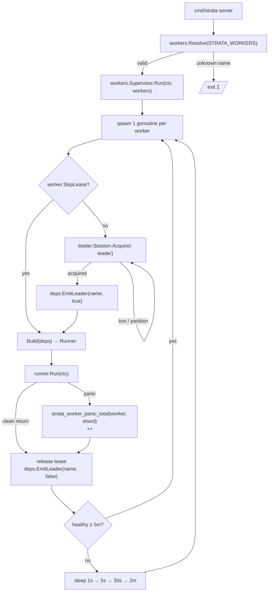
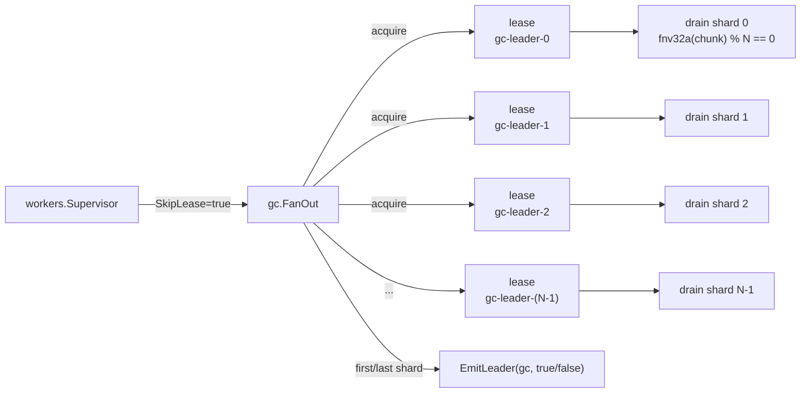

# Worker + leader election

Every background worker shares a single supervisor shape: one
goroutine per worker, leader-elected on a per-name lease, panic
recovered with exponential backoff, heartbeat chip wired to the
operator console. This page draws the lifecycle end-to-end and
points at the per-worker carve-outs.

## Lifecycle flowchart

## Supervisor responsibilities

`workers.Supervisor.Run(ctx, []workers.Worker)` is the entrypoint:

1. **Spawn one goroutine per worker.** No shared lifecycle — a panic in
   `gc` does not affect `lifecycle`.
2. **Acquire `<name>-leader`** unless `worker.SkipLease == true`.
   `leader.Session` is the contract; the Cassandra-backed
   implementation runs `INSERT IF NOT EXISTS` + periodic
   heartbeat-renew TTL; the in-memory implementation is a process-local
   `sync.Mutex` (sufficient for tests).
3. **Build the runner** from `workers.Dependencies` (`Logger`, `Meta`,
   `Data`, `Tracer`, `Locker`, `Region`, `EmitLeader`). Per-worker
   env knobs (`STRATA_GC_INTERVAL`, …) are read inside `Build`, not
   threaded through.
4. **Run `runner.Run(ctx)`** under a supervised context. The runner is
   expected to return on `ctx.Done()` cleanly.
5. **Recover from panic.** Bump
   `strata_worker_panic_total{worker=<name>,shard="-"}`, release the
   lease, restart on backoff.
6. **Backoff.** `1s → 5s → 30s → 2m`, reset to `1s` after the runner
   has been healthy for 5 consecutive minutes.
7. **Lease loss** (eviction / network partition) restarts the worker
   **immediately** with no backoff — losing a lease is normal flow,
   not a fault.

## SkipLease workers (gc fan-out)

A worker that owns its own leader-election internally registers with
`SkipLease: true`. The supervisor still owns panic recovery and
backoff; only the outer `<name>-leader` lease is skipped. The runner
manages its own leases and must call `deps.EmitLeader(name, acquired)`
from each transition so the heartbeat chip in the operator console
still flips on the supervisor's `LeaderEvents()` channel.

The canonical SkipLease worker is the **gc fan-out**:

Shard count is `STRATA_GC_SHARDS` (default `1`, range `[1, 1024]`).
The chip flips at most twice per cycle — even when the underlying
fan-out holds N shards on one replica, the heartbeat sees one
`acquired` and one `released` per cycle. Per-shard panics increment
`strata_worker_panic_total{worker="gc",shard="<i>"}` and restart on
the same `1s → 5s → 30s → 2m` backoff.

The same shape is reused by the rebalance worker (per-shard
`rebalance-leader-<i>` leases, count via `STRATA_REBALANCE_SHARDS`)
and the lifecycle worker (per-bucket `lifecycle-leader-<bucketID>`
gated by `fnv32a(bucketID) % STRATA_GC_SHARDS`).

## Heartbeat chip

The supervisor exposes `LeaderEvents() <-chan LeaderEvent`. Every
acquire / release flips an event; the gateway-side heartbeat
publisher reads the channel and updates the operator console's
"leader_for" chip. The chip is best-effort — a flapping lease
generates a flapping chip, but the operator sees the real-time state
without having to grep logs.

## Per-worker carve-outs

| Worker | Lease shape | SkipLease | Notes |
|---|---|---|---|
| `gc` | per-shard `gc-leader-<i>` | yes | fan-out via `STRATA_GC_SHARDS` |
| `lifecycle` | per-bucket `lifecycle-leader-<bucketID>` gated by `fnv32a(bucketID) % STRATA_GC_SHARDS == min(GCFanOut.HeldShards())` | yes | piggybacks on gc fan-out for shard ownership |
| `rebalance` | per-shard `rebalance-leader-<i>` | yes | fan-out via `STRATA_REBALANCE_SHARDS` |
| `notify` | single `notify-leader` | no | one drainer per cluster is enough; backoff + DLQ inside the worker |
| `replicator` | single `replicator-leader` | no | HTTPDispatcher cross-region |
| `access-log` | single `access-log-leader` | no | flush per source bucket |
| `inventory` | single `inventory-leader` | no | per `(bucket, configID)` tick inside the runner |
| `audit-export` | single `audit-export-leader` | no | partition-at-a-time drain |
| `manifest-rewriter` | single `manifest-rewriter-leader` | no | idempotent re-runs skip already-proto rows |
| `usage-rollup` | single `usage-rollup-leader` | no | nightly sample of bucket-usage stats |

## Why goroutines and not separate processes

A goroutine-per-worker shape keeps:

- Workers under the same Go runtime as the gateway (no extra
  Cassandra / TiKV / RADOS connection pools).
- The single-binary invariant (`strata server` + `strata admin`) per
  the project's CLAUDE.md.
- The supervisor's panic isolation cheap — `recover()` in a goroutine
  is sub-microsecond, restart is `Build(deps)` + a fresh
  `runner.Run(ctx)`.

A separate-process shape would force the leader-election machinery to
deal with N more independent process supervisors (systemd / Docker /
Kubernetes) and re-implement the heartbeat chip. The gain — physical
fault isolation across workers — is not worth the cost; the
in-process supervisor already gives logical fault isolation.

## Related

- [Workers]() — the worker
  registry, supervisor, per-worker reference.
- [PUT flow]() — where the
  gateway sits relative to the worker loops.
- [Drain pipeline]() —
  rebalance worker shard fan-out.
- [Concepts → Workers]() — the
  user-language view.
