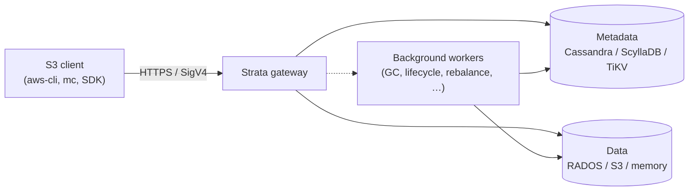

# Concepts

Strata is an S3-compatible object gateway. A single `strata` binary terminates
S3 traffic, stores object metadata in a scalable key-value store
(Cassandra, ScyllaDB, or TiKV), and persists object bytes as 4 MiB chunks in
RADOS, another S3 bucket, or in-process memory. The gateway is stateless —
state lives in the metadata store and the data backend, so you scale the
gateway horizontally without coordinating replicas yourself.

This section explains the user-facing concepts that show up in the rest of
the docs: the S3 surface Strata speaks, how it routes data across multiple
clusters, how a cluster is drained and decommissioned, and the background
workers that run alongside the gateway. Implementation details live in
[Architecture](); start here for the model
operators need to reason about.

## Architecture at a glance

The S3 client talks to the gateway over HTTP using SigV4. The gateway looks
up object metadata, streams object bytes to or from the data backend, and
returns S3-shaped responses. Background workers run in the same binary and
do not touch the request path — they read the queues and tables the gateway
writes and act on them asynchronously.

## What to read next

- [S3 surface]() — the S3 operations Strata implements.
- [Multi-cluster routing]() — per-bucket placement and the cluster-weight wheel.
- [Drain & rebalance]() — taking a cluster out of rotation safely.
- [Workers]() — the background loops Strata runs.

When you want implementation depth — request flow, storage layout,
leader election — jump to [Architecture]().
