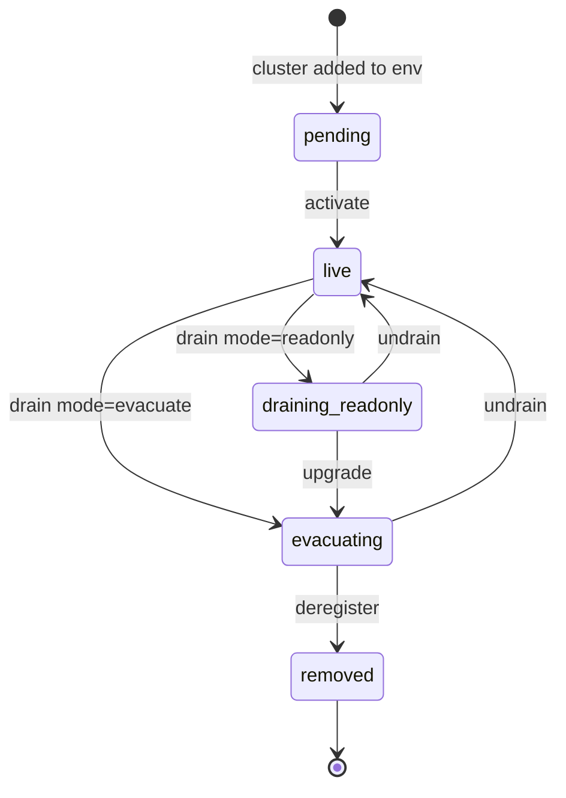

# Drain & rebalance

Taking a data cluster out of rotation is a multi-step process: stop new
writes, move existing bytes off, then remove the cluster from the
configuration. Strata models this as an explicit lifecycle so operators can
follow progress and abort partway through if needed.

## Lifecycle

- **`pending`** — a new cluster ID was added to `STRATA_RADOS_CLUSTERS` or
  `STRATA_S3_CLUSTERS` but the gateway has not yet been told to route
  default traffic to it. Reads and explicit-policy writes work; default
  routing skips it.
- **`live`** — normal operating state. The cluster participates in the
  default-routing weight wheel.
- **`draining_readonly`** — operator-initiated stop-write drain. New PUTs
  refuse with `503 DrainRefused`. Reads, deletes, and in-flight multipart
  sessions keep working. The rebalance worker does not actively move
  data — use this for maintenance windows.
- **`evacuating`** — operator-initiated decommission drain. Same write
  refusal as `draining_readonly`, plus the rebalance worker scans the
  cluster and migrates chunks to the remaining clusters honoring each
  bucket's placement policy. A live progress chip in the operator console
  shows bytes moved, estimated time remaining, and per-bucket breakdown.
- **`removed`** — cluster is gone. Excluded from every code path.

## Drain refusal semantics

While a cluster is draining, the gateway answers PUTs that would have
landed on it with `503 DrainRefused` and a `Retry-After: 300` header. This
is **PUT only** — reads, deletes, HEAD, multipart `UploadPart` /
`CompleteMultipartUpload` / `AbortMultipartUpload`, and `ListObjects`
continue working against the draining cluster. The intent is stop-write,
not stop-read.

In-flight multipart sessions that started against the cluster before the
drain finish on the original cluster — the multipart upload handle pins
its initial cluster so a drain mid-upload does not orphan the parts.

## Operator workflow

The high-level steps for decommissioning a cluster:

1. **Preview impact.** `GET /admin/v1/clusters/{id}/bucket-references`
   lists buckets that route to the cluster, with chunk and byte counts.
   Use this to spot pinned buckets that will refuse writes once draining
   starts.
2. **Drain.** `POST /admin/v1/clusters/{id}/drain {mode: "evacuate"}`
   flips the cluster into `evacuating`. The rebalance worker starts
   moving chunks.
3. **Watch progress.** The operator console shows live progress; the
   admin API exposes `GET /admin/v1/clusters/{id}/drain-progress` for
   scripting.
4. **Wait for `deregister_ready`.** The drain is complete when chunks on
   cluster reach zero and no in-flight multipart sessions remain.
5. **Deregister.** Remove the cluster from `STRATA_RADOS_CLUSTERS` /
   `STRATA_S3_CLUSTERS` and roll the gateway.

For the step-by-step workflow with example commands, see
[Placement + rebalance]().

## Why two drain modes

The two modes target two different scenarios:

- **`readonly`** is for short maintenance windows where you want to stop
  new writes but plan to bring the cluster back. No data migration runs.
- **`evacuating`** is for permanent decommissioning. Data migration runs
  until the cluster is empty.

You can upgrade a `readonly` drain to `evacuate` without first reverting
to `live`. Going back to `live` from either drain state cancels the drain
and re-enables the cluster.

## Where to read next

- [Placement + rebalance best practices]() — step-by-step workflow and knob tuning.
- [Architecture: drain pipeline]() — implementation details.
