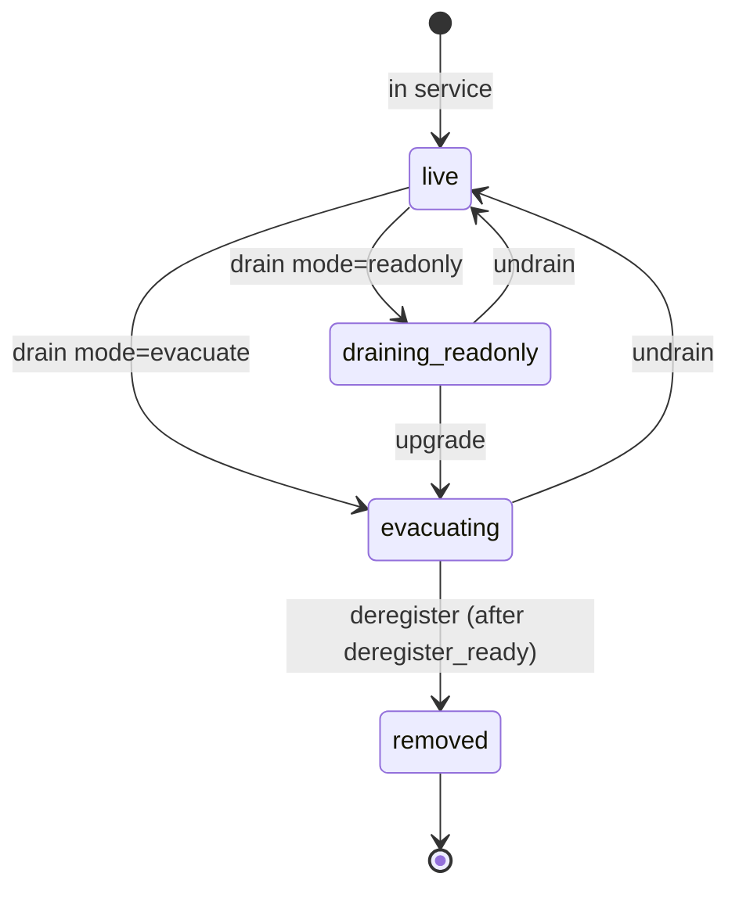

# Drain a cluster

Taking a data cluster out of rotation is a five-step workflow:
**preview impact → drain → watch progress → wait for deregister-ready
→ remove from env**. Strata exposes each step through the admin API
and the operator console so you can drive the workflow from the
browser or from a shell script.

This page is the day-2 runbook. The
[Drain & rebalance concept]()
covers the lifecycle states; the
[Placement + rebalance best-practice]()
covers tuning the rebalance throughput and the cluster-state machine
in depth.

## Lifecycle at a glance



Two drain modes:

| Mode | State | Moves bytes | When to use |
|---|---|---|---|
| `readonly` | `draining_readonly` | No | Short maintenance window. Stops new writes; reads + deletes + in-flight multipart keep working. |
| `evacuate` | `evacuating` | Yes | Permanent decommission. Rebalance worker migrates every chunk off the cluster to its bucket's policy targets. |

You can upgrade a `readonly` drain to `evacuate` without first
returning to `live`. Going back to `live` from either drain state
cancels the drain and re-enables the cluster.

## Step 1 — Preview impact

Before flipping the drain, ask Strata which buckets sit on the
cluster:

```bash
curl -s http://strata/admin/v1/clusters/oldc/bucket-references | jq .
```

The response lists every bucket whose `Placement` policy names `oldc`
plus its current chunk count and byte usage. Look for:

- **Buckets that pin `oldc` exclusively.** Their PUTs will refuse with
  `503 DrainRefused` once the drain starts. Update the placement
  policy to a peer cluster first, or accept the refusal during the
  drain window.
- **Buckets in strict placement mode** whose policy is `oldc` alone.
  These will not auto-fallback to the cluster-weights wheel and the
  drain will mark them as `stuck_single_policy`. Flip to weighted
  mode or update the policy before draining.

The operator console exposes the same data on the cluster card under
**Bucket impact** → **Show details**.

## Step 2 — Drain

Flip the cluster into the drain state you want:

```bash
# Maintenance window — stop writes, do not move data.
curl -X POST http://strata/admin/v1/clusters/oldc/drain \
  -H 'Content-Type: application/json' \
  -d '{"mode": "readonly"}'

# Decommission — stop writes AND migrate bytes off.
curl -X POST http://strata/admin/v1/clusters/oldc/drain \
  -H 'Content-Type: application/json' \
  -d '{"mode": "evacuate"}'
```

The admin handler:

1. Writes the new state into the `cluster_state` table.
2. Invalidates the in-process drain cache on the local replica so
   the flip takes effect immediately.
3. Stamps an `admin:DrainCluster` row in the audit log.

Other replicas pick up the change on their next 30 s drain-cache
refresh, so the drain is fully active cluster-wide within 30 s of the
first call. For zero-window propagation, hit each replica's
`/drain` endpoint directly (the calls are idempotent).

From this moment:

- PUTs that would have landed on `oldc` return `503 DrainRefused`
  with `Retry-After: 300`. The metric
  `strata_putchunks_refused_total{reason="drain_refused",cluster="oldc"}`
  ticks per refusal.
- Reads, deletes, HEAD, multipart `UploadPart` / `Complete` / `Abort`,
  and `ListObjects` keep working against `oldc`. Drain is stop-write,
  not stop-read.
- In-flight multipart sessions that started before the drain finish
  on `oldc` — the upload handle pins its initial cluster.

## Step 3 — Watch progress

For `evacuate` drains, the rebalance worker starts scanning the
cluster and migrating chunks the moment the state flips. Watch
progress from the console or the API.

**Operator console.** The cluster card flips to the `evacuating` state
and shows three live chips:

- **Bytes moved / total** — current progress against the scan's
  baseline byte count.
- **ETA** — estimated time remaining, derived from the rolling
  migration rate.
- **Bandwidth** — current chunk-move throughput in MiB/s, capped by
  `STRATA_REBALANCE_RATE_MB_S` (default 100).

A `<DrainProgressBar>` visualises bytes moved; a per-bucket breakdown
table shows which buckets are still draining.

**API.** `GET /admin/v1/clusters/{id}/drain-progress` returns a JSON
snapshot:

```bash
curl -s http://strata/admin/v1/clusters/oldc/drain-progress | jq .
```

The payload carries `migratable_chunks`, `stuck_single_policy_chunks`,
`stuck_no_policy_chunks`, total bytes, baseline bytes, the last scan
timestamp, and a per-bucket breakdown. Use it for scripted drains or
custom dashboards.

**Metrics.** The operator-facing shortlist:

| Metric | Watch for |
|---|---|
| `strata_rebalance_chunks_moved_total{from="oldc"}` | Counter increase = migration making progress. Plateau = drain stalled or complete. |
| `strata_rebalance_refused_total{reason,target}` | Non-zero on `target_full` / `target_draining` = peer clusters cannot accept. Investigate before continuing. |
| `strata_drain_complete_total{cluster="oldc"}` | Fires exactly once when chunks on cluster reach zero. |
| `strata_putchunks_refused_total{reason="drain_refused"}` | PUT-side stop-write counter. Steady = clients still trying to write to the drained cluster; update their placement policy. |

If progress stalls (`chunks_moved_total` flat for ≥ 5 min while
`migratable_chunks > 0`), check the
[Placement + rebalance troubleshooting]()
page for CAS-conflict storms and target-full refusals.

## Step 4 — Wait for `deregister_ready`

The drain is **safe to deregister** only when the API flips
`deregister_ready=true`. This requires three independent conditions
to clear:

1. **Chunks on cluster = 0.** The rebalance scan reports zero
   migratable chunks remaining.
2. **No pending GC entries** target the drained cluster. The GC queue
   drains chunk-shape entries whose `cluster` matches the drained
   id; until those drain, the chunks still exist physically.
3. **No in-flight multipart sessions** are pinned to the drained
   cluster. Pre-drain uploads finish on their original cluster, so
   `deregister_ready` waits for them.

Watch the flag in the cluster card or via:

```bash
curl -s http://strata/admin/v1/clusters/oldc | jq '.deregister_ready, .blocked_reasons'
```

`blocked_reasons` enumerates which of the three preconditions is
still pending — `chunks_remaining`, `gc_entries_remaining`,
`multipart_uploads_remaining`. The console renders one chip per
reason next to a `✓ Ready to deregister` confirmation chip.

A `drain.complete` audit row fires the moment chunks on cluster reach
zero; pair the alert with the `strata_drain_complete_total{cluster}`
counter if you want to be paged.

## Step 5 — Deregister and remove from env

Once `deregister_ready=true`:

1. **Drop the cluster id** from `STRATA_RADOS_CLUSTERS` (or
   `STRATA_S3_CLUSTERS` for S3 data backends) in the gateway env.
2. **Roll the gateway replicas.** The next boot reconcile walks the
   `cluster_state` table; clusters absent from env that are not
   already `removed` transition to `removed`.
3. **Verify.** `GET /admin/v1/clusters` no longer lists `oldc`. The
   admin audit log has a `cluster_state.removed` row.

You can also tear down the cluster's physical resources (RADOS pool,
Ceph OSDs, S3 bucket) — Strata holds no more references to it.

## Aborting a drain

If you change your mind mid-drain (operator picked the wrong cluster,
peer clusters are over-pressure, business priorities shifted), undrain
the cluster:

```bash
curl -X POST http://strata/admin/v1/clusters/oldc/undrain
```

The state machine flips:

- `draining_readonly → live` cleanly; the cluster is back in the
  weight wheel with its original weight.
- `evacuating → live` cancels future moves but **migrated chunks stay
  on their new target**. There is no reverse migration. Re-draining
  later starts from the post-undrain state, not the original layout.

The undrain handler invalidates the local drain cache and audits
`admin:UndrainCluster`. Other replicas pick up the flip within 30 s.

## Safety rails

The rebalance worker refuses moves into clusters that are themselves
draining or above 90 % utilisation (RADOS only — `ceph df` reads the
target's free space before each move). Refusals bump
`strata_rebalance_refused_total{reason,target}` and surface in the
console as a banner on the cluster card. Two scenarios you may see:

- `reason="target_draining"` — you started a second drain before the
  first completed and the worker tried to land bytes on the second
  draining cluster. Order drains strictly: drain → wait for
  deregister-ready → deregister → start the next drain.
- `reason="target_full"` — peer clusters are above the 90 %
  utilisation threshold. Add capacity (more OSDs / a new cluster)
  before continuing.

## See also

- [Drain & rebalance concept]()
  — lifecycle states, drain refusal semantics, two drain modes.
- [Placement + rebalance best practices]()
  — knob tuning, troubleshooting, the full safety-rail matrix.
- [Monitoring]() — the rebalance
  and refusal metrics.
- [Architecture]() — the drain
  pipeline implementation.
