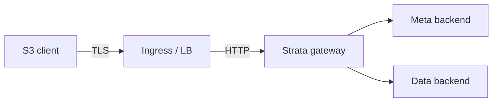
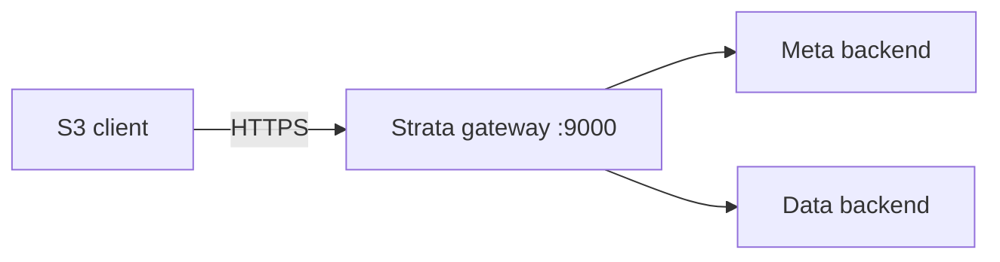
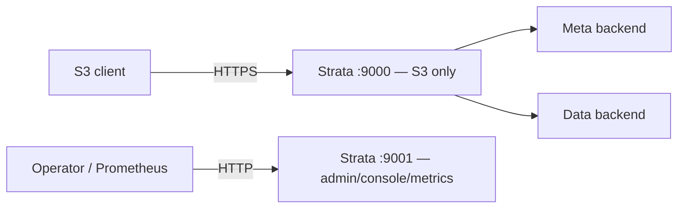
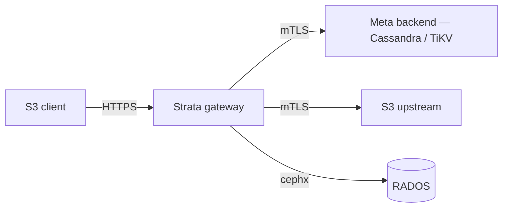

# TLS termination + backend mTLS

This is the operator playbook for putting Strata on the wire securely.
The gateway can terminate TLS itself (recommended for prod) or sit behind
a load balancer that handles termination upstream. Backend connections
(Cassandra, TiKV, S3-upstream) each take an opt-in mutual-TLS bundle so a
network intruder cannot impersonate the gateway. RADOS is the one
exception: it authenticates via Ceph's native cephx protocol and ignores
the TLS layer entirely (see [RADOS uses cephx](#rados-uses-cephx-not-tls)
below).

The four shapes below are arranged shallowest to deepest. Pick the
shallowest one that satisfies the threat model — every shape adds an
opt-in env block on top of the previous one and the defaults from any
shape remain valid.

## Deploy shapes

### Shape A — plain HTTP behind an ingress

The simplest shape. A load balancer / ingress controller terminates TLS;
Strata speaks plain HTTP on the cluster network. Operator-supplied
`STRATA_TRUSTED_PROXIES` lets the gateway honor the ingress's
`X-Forwarded-Proto` for the `Secure` cookie flag.



| Env | Value |
|---|---|
| `STRATA_LISTEN` | `:9000` |
| `STRATA_TRUSTED_PROXIES` | ingress source CIDR (e.g. `10.0.0.0/8`) |
| `STRATA_TLS_CERT_FILE` | empty |

Pros: certificate lifecycle owned entirely by the ingress. Cons: traffic
between the ingress and Strata is unencrypted; only fits a private
network.

### Shape B — Strata-terminated, single port

Strata terminates TLS and serves S3 + admin + console + metrics on the
same port. Fits a small deployment behind a network policy.



| Env | Value |
|---|---|
| `STRATA_LISTEN` | `:9000` |
| `STRATA_TLS_CERT_FILE` | `/etc/strata/tls/tls.crt` |
| `STRATA_TLS_KEY_FILE` | `/etc/strata/tls/tls.key` |
| `STRATA_TLS_MIN_VERSION` | `TLS1.2` |
| `STRATA_TLS_CIPHER_PROFILE` | `mozilla-modern` |

Multi-tenant deployments swap the single-cert envs for `STRATA_TLS_CERT_DIR`
and SNI-driven dispatch (US-003 of `ralph/harden-gateway`):

| Env | Value |
|---|---|
| `STRATA_TLS_CERT_DIR` | `/etc/strata/tls/` |
| `STRATA_TLS_RELOAD_INTERVAL` | `60s` |
| `STRATA_TLS_CLIENT_CA_FILE` | (optional) PEM CA for client-cert auth |

The cert dir is walked at boot for `*.crt` + matching `*.key` pairs; the
`tls.Config.GetCertificate` callback dispatches per-handshake via SAN
lookup. Reload is fsnotify-driven with a 60s re-stat fallback so kubelet
ConfigMap / Secret atomic-symlink swaps are picked up without a
gateway restart.

### Shape C — Strata-terminated, split admin + S3 listeners

The admin / console / metrics endpoints bind to a separate listener
(loopback or RFC1918) so a public S3 client cannot reach the admin
API even if `NetworkPolicy` fails open. **Recommended for prod** as
defense-in-depth.



| Env | Value |
|---|---|
| `STRATA_LISTEN` | `:9000` |
| `STRATA_TLS_CERT_FILE` | `/etc/strata/tls/tls.crt` |
| `STRATA_TLS_KEY_FILE` | `/etc/strata/tls/tls.key` |
| `STRATA_ADMIN_LISTEN` | `127.0.0.1:9001` |
| `STRATA_ADMIN_HTTP_WRITE_TIMEOUT` | `2m` (default) |

When set, the admin listener receives `/admin/v1/*`, `/console/*`,
`/metrics`, `/healthz`, `/readyz`. The S3 catch-all (`/`) stays on the
primary listener. Both listeners share the same OTel tracer, audit
middleware instance, structured logger, and access-log chain — only the
mux + `*http.Server` pair is duplicated.

Optional admin-side mTLS pins access to operator client certs:

| Env | Value |
|---|---|
| `STRATA_ADMIN_TLS_CERT_FILE` | `/etc/strata/admin-tls/tls.crt` |
| `STRATA_ADMIN_TLS_KEY_FILE` | `/etc/strata/admin-tls/tls.key` |
| `STRATA_ADMIN_TLS_CLIENT_CA_FILE` | `/etc/strata/admin-tls/operators-ca.crt` |

When `STRATA_ADMIN_TLS_CLIENT_CA_FILE` is set, every connection to the
admin listener must present a client cert signed by the CA
(`ClientAuth=RequireAndVerifyClientCert`).

### Shape D — Strata-terminated + backend mTLS

Builds on Shape C. Every backend (Cassandra, TiKV, S3-upstream) gets an
mTLS bundle so the gateway authenticates itself to the backend on every
connection. RADOS continues to use cephx (see the dedicated section);
the data-tier confidentiality story is covered by Ceph's
`ms_cluster_mode=secure`.



Combine the per-backend env blocks from
[Backend mTLS](#backend-mtls) below with Shape C.

## Cert provisioning recipes

### cert-manager (Kubernetes)

cert-manager issues a `Secret` mounted onto the Strata pod. kubelet's
atomic-symlink-swap rotation is picked up automatically by the
fsnotify + 60s re-stat fallback.

```yaml
apiVersion: cert-manager.io/v1
kind: Certificate
metadata:
  name: strata-tls
  namespace: strata
spec:
  secretName: strata-tls
  dnsNames:
    - s3.example.com
    - "*.s3.example.com"
  issuerRef:
    name: letsencrypt-prod
    kind: ClusterIssuer
```

Mount the Secret onto the Strata container at `/etc/strata/tls/` and
set:

```yaml
env:
  - name: STRATA_TLS_CERT_FILE
    value: /etc/strata/tls/tls.crt
  - name: STRATA_TLS_KEY_FILE
    value: /etc/strata/tls/tls.key
  - name: STRATA_TLS_RELOAD_INTERVAL
    value: 60s
```

For SNI multi-cert, point `STRATA_TLS_CERT_DIR=/etc/strata/tls/` at a
directory volume that aggregates several Secrets via `projected`.

### Vault PKI

Vault's PKI secrets engine issues short-lived certs (24h TTL is common).
A side-car renewer like
[vault-pki-renewer](https://github.com/hashicorp/vault-pki-renewer) writes
the rotated cert + key into `/etc/strata/tls/` and the gateway picks the
new pair up via the periodic re-stat (no SIGHUP / restart needed).

```bash
vault write pki/issue/strata-gateway \
  common_name=s3.example.com \
  ttl=24h \
  format=pem \
  | jq -r .data.certificate > /etc/strata/tls/tls.crt
```

### openssl (lab / dev)

For local labs, generate a self-signed P-256 ECDSA cert. The smoke
script `scripts/smoke-tls.sh` uses the same recipe:

```bash
openssl req -x509 -newkey ec -pkeyopt ec_paramgen_curve:prime256v1 \
  -keyout /etc/strata/tls/tls.key \
  -out /etc/strata/tls/tls.crt \
  -days 30 -nodes \
  -subj "/CN=localhost" \
  -addext "subjectAltName=DNS:localhost,IP:127.0.0.1"
```

`openssl s_client` is too interactive for unattended health checks —
prefer `curl --cacert /etc/strata/tls/tls.crt https://host:port/healthz`.

## Backend mTLS

Every backend takes an opt-in mTLS bundle. The shape is identical across
all three backends: CA file, client cert file, client key file, skip-verify
toggle. Empty all four = plain-TCP / plain-gRPC / plain-HTTP (the
pre-`ralph/harden-gateway` default).

A boot-time WARN + the gauge
`strata_backend_tls_skip_verify{backend,cluster}=1` fires on any
backend whose `SKIP_VERIFY` is true. Alert on
`sum(strata_backend_tls_skip_verify) > 0` to catch a stray-prod knob.

### Cassandra

| Env | Notes |
|---|---|
| `STRATA_CASSANDRA_TLS_CA_FILE` | PEM CA bundle for server-cert validation. |
| `STRATA_CASSANDRA_TLS_CERT_FILE` | PEM client cert for mTLS. Half-pair with `KEY_FILE` rejected at boot. |
| `STRATA_CASSANDRA_TLS_KEY_FILE` | PEM private key paired with `CERT_FILE`. |
| `STRATA_CASSANDRA_TLS_SKIP_VERIFY` | `true` flips `tls.Config.InsecureSkipVerify` AND `gocql.SslOptions.EnableHostVerification=false`. Never set in production. |

The matched-pair flip on `SKIP_VERIFY` is intentional — gocql's
historical disclaimer warns that setting either alone leaves the driver
in a half-checked state.

### TiKV

| Env | Notes |
|---|---|
| `STRATA_TIKV_TLS_CA_FILE` | **Required** when any other `STRATA_TIKV_TLS_*` knob is set (tikv-client-go's `Security.ToTLSConfig` short-circuits on empty `ClusterSSLCA`, silently downgrading to plain-gRPC). |
| `STRATA_TIKV_TLS_CERT_FILE` | PEM client cert. Paired with `KEY_FILE`. |
| `STRATA_TIKV_TLS_KEY_FILE` | PEM private key paired with `CERT_FILE`. |
| `STRATA_TIKV_TLS_SKIP_VERIFY` | Disables PD HTTP control-plane validation. The gRPC data plane is bound to tikv-client-go's global `Security` — `SKIP_VERIFY` is honored on PD HTTP only. |

PD endpoints accept `https://` scheme when TLS is configured. Bare
`pd-server.example.com:2379` is auto-prefixed with `https` when any
TiKV TLS env is set.

### S3 upstream

| Env | Notes |
|---|---|
| `STRATA_S3_TLS_CA_FILE` | Global default PEM CA bundle. |
| `STRATA_S3_TLS_CERT_FILE` | Global default client cert. |
| `STRATA_S3_TLS_KEY_FILE` | Global default client key. |
| `STRATA_S3_TLS_SKIP_VERIFY` | Disable server-cert validation; bumps `strata_backend_tls_skip_verify{backend="s3",cluster=<id>}=1` for every cluster that resolves to this bundle. |

Per-cluster overrides on the `STRATA_S3_CLUSTERS` JSON schema replace
the global block **outright** for that cluster — no per-field merge.
Setting any single per-cluster `tls.*` key locks in the per-cluster
bundle. Example:

```json
[
  {
    "id": "primary",
    "endpoint": "https://s3-a.internal:9000",
    "region": "us-east-1",
    "credentials_ref": "primary"
  },
  {
    "id": "secondary",
    "endpoint": "https://s3-b.internal:9000",
    "region": "us-east-1",
    "credentials_ref": "secondary",
    "tls": {
      "ca_file": "/etc/strata/s3-secondary/ca.pem",
      "cert_file": "/etc/strata/s3-secondary/client.pem",
      "key_file": "/etc/strata/s3-secondary/client.key"
    }
  }
]
```

The first cluster falls back to the global `STRATA_S3_TLS_*` block (or
the Go-default HTTP client if both are empty); the second uses its own
per-cluster bundle and ignores the global block.

## RADOS uses cephx, not TLS

Strata does **not** ship an mTLS layer for the RADOS data backend.
`librados` authenticates via Ceph's native **cephx** mutual-auth
protocol, which is the production-supported path: clients prove
possession of the keyring (`STRATA_RADOS_KEYRING` /
`[rados].keyring`) to the MON cluster on every connection, and the MON
cluster signs the OSD-level capability tokens that gate every read +
write. Adding a TLS layer on top would re-encrypt an
already-mutually-authenticated channel and add a second key-distribution
surface that operators would have to keep in sync.

If you need wire-level confidentiality on a public-network Ceph
cluster, configure `ms_cluster_mode=secure` + `ms_client_mode=secure`
in your `ceph.conf` — the cephx handshake then encrypts the messenger
payload end-to-end. See the upstream
[Ceph networking](https://docs.ceph.com/en/latest/rados/configuration/msgr2/)
notes; no Strata-side knob is required.

## See also

- [Best Practices — Production hardening]() — 12-line checklist for prod readiness.
- [Reference — STRATA_* environment variables]() — every TLS / mTLS / admin / rate-limit env, with TOML key, default, and range.
- [Operate — Monitoring]() — Prometheus alerts on `strata_backend_tls_skip_verify` + `strata_ingress_rate_limit_refused_total`.
